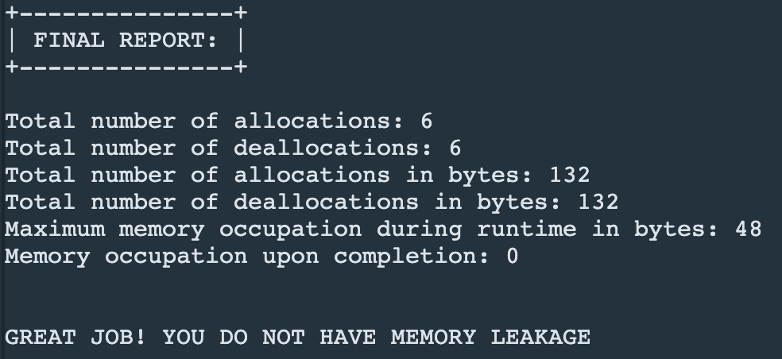

## Garbage-Collector (C++)
C++ garbage collector implementation to check if there are any memory leaks!

## Building

To compile and run `main.cpp`:

``` shell
$ ./make
$ ./compiled
```

## Sample result

Following is a sample output image:

